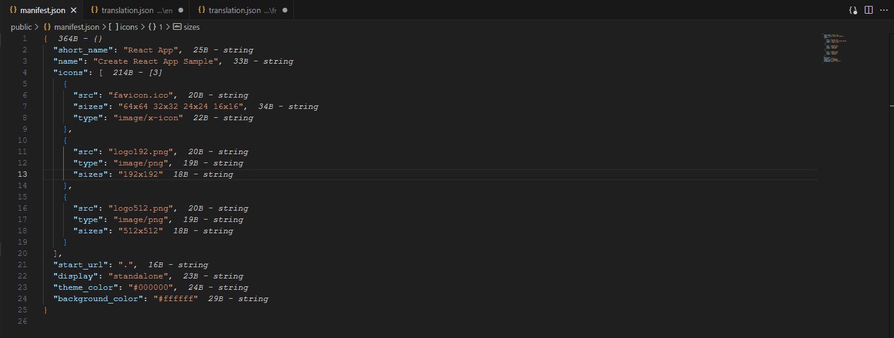

# magic-json

Magic JSON extension provides meaningful insights on JSON files.

## Features

## Extension Settings

This extension has the following settings:

* `magic-json.enable`: enable/disable this extension
* `magic-json.colorSizeLimits`: display the text in the specified color if the json object size fall in the specified limits